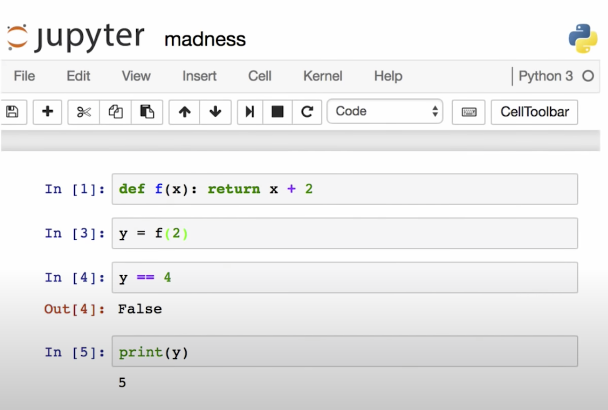

# Time Travel for Python

<br>

 Antonio Piccolboni $\quad$ http://piccolboni.info


---




Credit: Joel Grus, Why I don't like notebooks

---


Editor + Console

<br>


<p class="fragment"> Editor $\leftrightarrow$ Cut-and-paste $\leftrightarrow$ REPL
$\rightarrow$ Python</p>


<br>


<p class="fragment">Atom $\rightarrow$   Hydrogen $\rightarrow$
Ipykernel $\rightarrow$ Python</p>

---

## There must be a better way!

Credit: Raymond Hettinger


---

- [game development](https://youtu.be/EGqwXt90ZqA?t=829)
- [algorithm exploration](https://youtu.be/PUv66718DII?t=1225)

Credit: Bret Victor, "Inventing on Principle"

---

Code:
```python
statement_s1
statement_s2
statement_s3
```

---


Allowed states:

  - S<sub>s1</sub>
  - S<sub>s1; s2</sub>
  - S<sub>s1; s2; s3</sub>

---

Forbidden states:

  - S<sub>s1;s3</sub> (skipping code)
  - S<sub>s1; s1</sub> (repetition)
  - everything that is not allowed


---

## Solution: rewinding computations


---


Prior art: scientific, long lasting, distributed computations


---

Prior art: python debuggers

- *timetraveldb*
- *epdb*
- revdb
- pytrace


---


```python
checkpoint() # 1
statement_s1
checkpoint() # 2
statement_s2
checkpoint() # 3
statement_s3
rewind(n)    # n = 1,2,3
```

<br>

<p class="fragment">To execute up to block `s<i>`, execute up to
`s<i-1>`, or rewind to checkpoint #i, then execute `s<i>`</p>

---


```python
from rew import rewind, checkpoint

a = 0
print(a)
checkpoint()
print(a)
a = 1
print(a)
rewind()  # pop and go back
print(a)
```

Note:`basic_example.py`

---


```python
from rew import rewind, checkpoint
from random import randint

print(randint(0, 99))
checkpoint()
print(randint(0, 99))
rewind()
print(randint(0, 99))
```

Note:`reverse_random_generator.py`

---


```python
from rew import rewind, checkpoint
from datetime import datetime

now = datetime.now

print(now())
checkpoint()
print(now())
rewind()
print(now())
```

Note:`reverse_datetime.pyt`

---

## [Time Travel](https://youtu.be/SR5BfQ4rEqQ?t=160)

---

&nbsp;

```python
from rew import rewind, checkpoint
from sys import stdin


loc = dict()
glob = dict()

while True:
    checkpoint()
    print(loc)
    print(">>>", end="", flush=True)
    snippet = stdin.readline().strip()
    if snippet == "":
        rewind(-1)
        break
    if snippet == "undo":
        rewind()
    else:
        try:
            exec(snippet, glob, loc)
        except Exception as e:
            print(e)
```

Note:`reversible_interpreter.py`


---

&nbsp;


```

iris = data.iris()

iris$ratio = iris$petalLength/irisSepalLength

boxplot(iris, "petalLength", group = "species")

```

---

&nbsp;


```
                      # checkpoint()
iris = data.iris()
                      # checkpoint()
iris$ratio = iris$petalLength/irisSepalLength
                      # checkpoint()
boxplot(iris, "petalLength", group = "species")

```


---

&nbsp;


<pre>
                      # checkpoint()
iris = data.iris()
                      # checkpoint()
iris$ratio = iris$petalLength/irisSepalLength <span style="color:red;">+ 1</span>
                      # checkpoint()
boxplot(iris, "petalLength", group = "species")
                      <span style="color:red;"># rewind(2)</span>
</pre>
